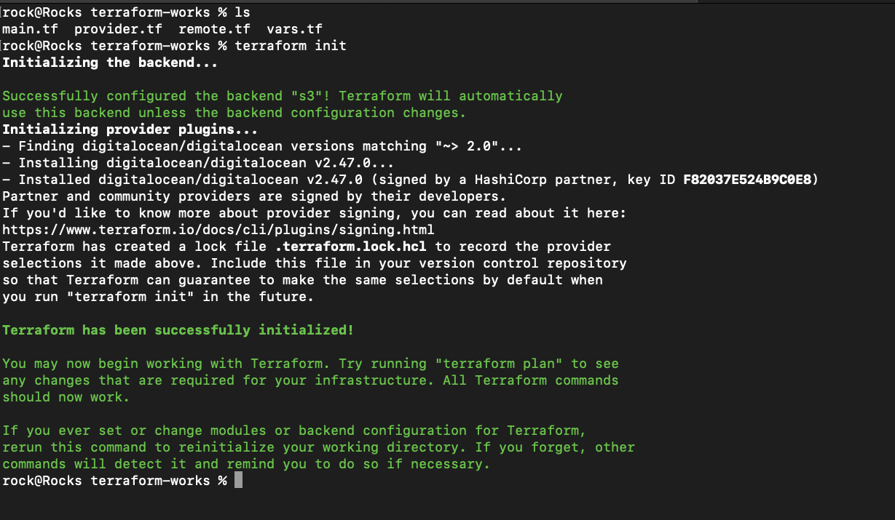
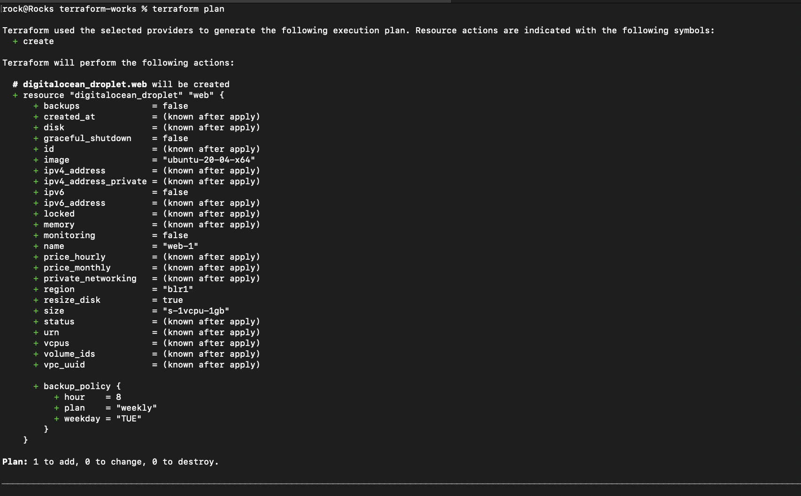
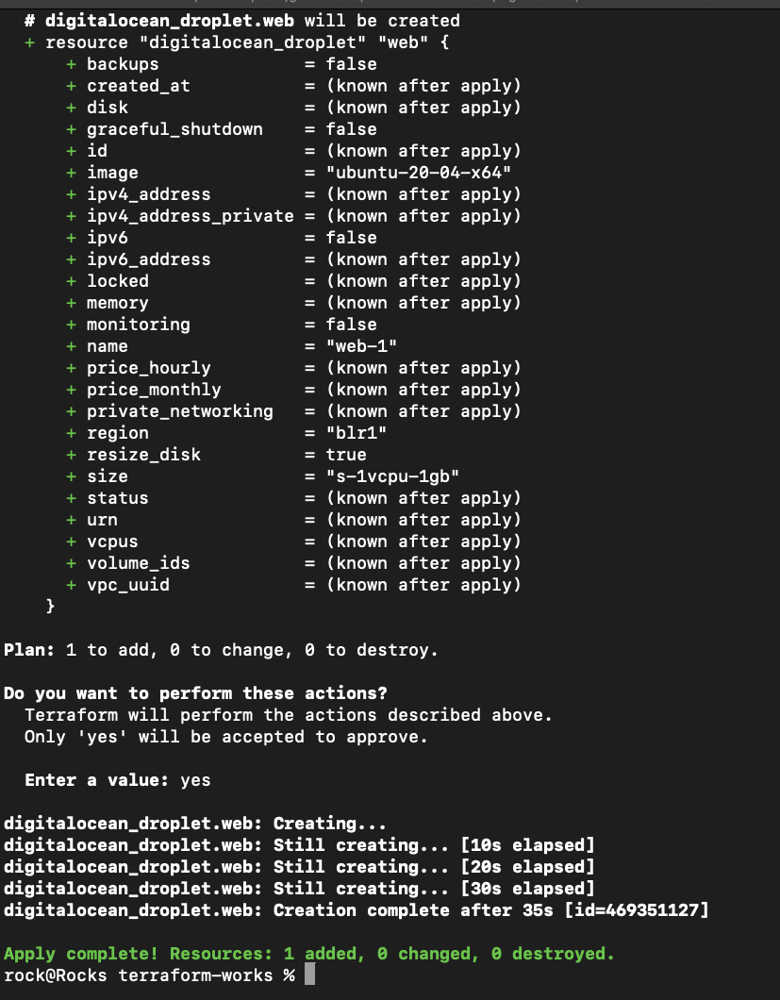
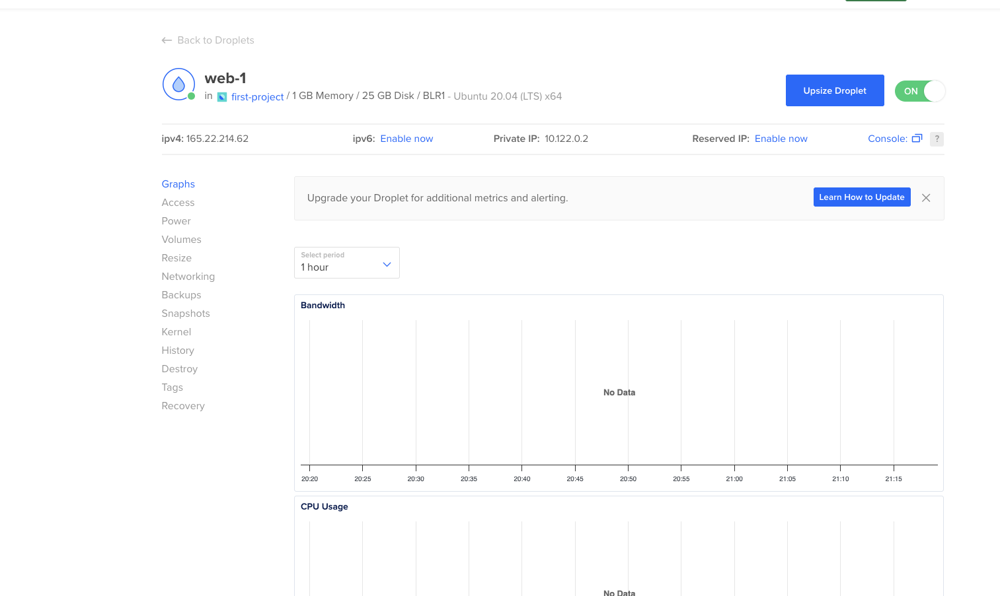
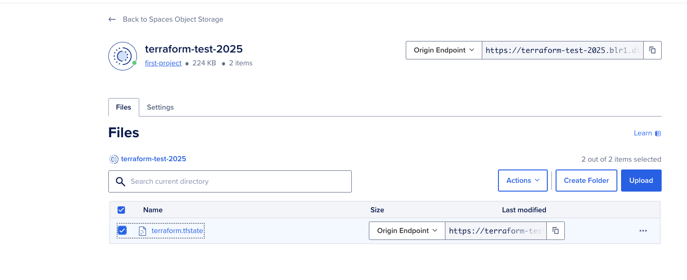
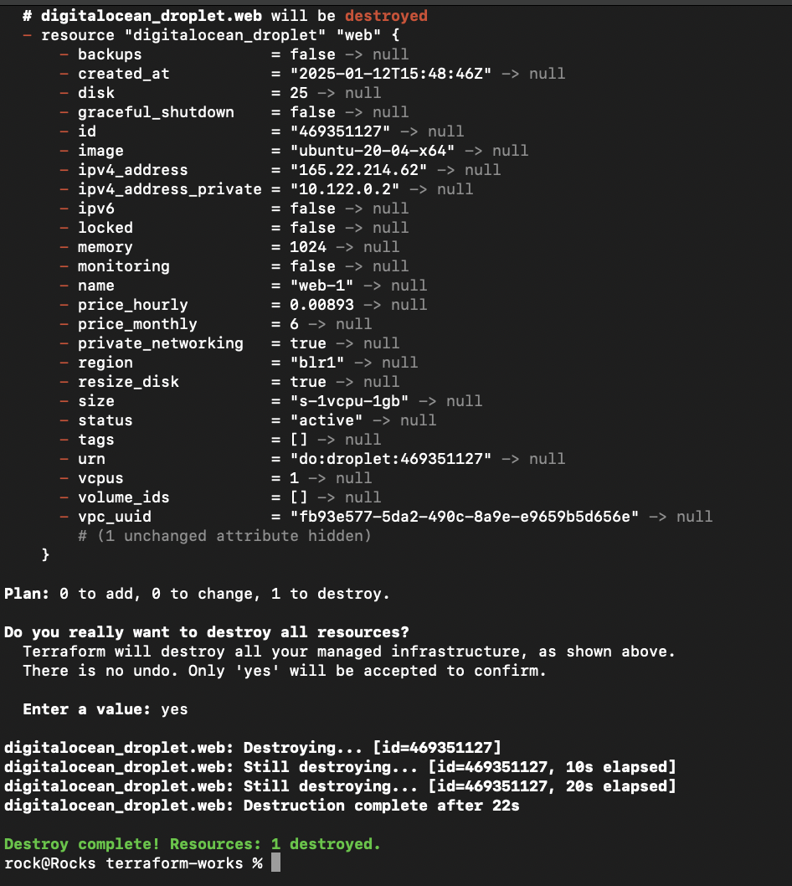

# terraform-works-2025


### STEPS:-

Here are the commands that you need to apply

**EXPORT S3 KEYS**

```
export AWS_ACCESS_KEY_ID="DO00WVBP7xxxxxxx"
export AWS_SECRET_ACCESS_KEY="17fkCXxxCGNAxxxxx/DYf/xxxxx"

```

**Terraform initialization for download modules and plugins**

```
terraform init

```




**Terraform planning for infra**

```
terraform plan

```




**Creating the infra**

```
terraform apply

```



Here you can see that droplet is created and tfstate file is also present in s3 bucket







**Destroying the infra**

```
terraform destroy

```




***REFERENCE***

https://registry.terraform.io/providers/digitalocean/digitalocean/latest/docs

https://docs.digitalocean.com/products/spaces/reference/terraform-backend/

